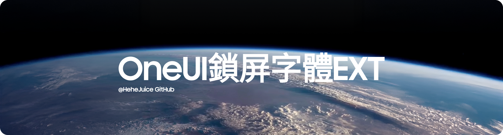

#️⃣ : [English](README.md) - [中文](README_CN.md) - [Tiếng Việt](README_VI.md) - [日本語](README_JP.md)

<h1 align="center">
  
</h1>

# 🗺️ 項目概述
OneUI鎖屏字體EXT（OneUI-Lockscreen-Font-EXT）是一個為 OneUI 鎖定畫面介面添加更多字體的項目

支援版本 OneUI 6 + 

  
    
    

  ### 🤔 它是如何運作的呢？
安裝 ZIP 檔案中的 APK 文件，然後在鎖定畫面編輯器中開啟「更多字型」選項。 

  

 ### 😵 聲明
> [!NOTE]
> * 我拒絕製作任何與 iOS 主題相關的東西
> * OPPO 大時鐘字體的出現是因為 Android（HyperOS） [October 29, 2024] 比iOS 26 [September 15, 2025] 更早發布了「長時鐘樣式」
因此，在我看來，它屬於 Android 風格
> * [更多有關資料](HeheJuice/ResultCN.png)
> * 我不討厭 iOS，我有iOS 26的iPad,我不製作 iOS 主題的原因是為了保持 Android 自身的風格。

 ### ℹ️ 現已推出的字體 [鳴謝]

| 字體名稱 | 開發者/鳴謝 |
| :--- | :--- |
| **OPPO 大時鐘字體** | OPPO |
| **鴻蒙字體 Super Bold** | 華為 |
| **Bodoni Moda** | Owen Earl |
| **DM Serif Display** | Colophon Foundry |
| **Gravitas One** | Riccardo De Franceschi |
| **CreatoDisplayRegular** | Anugrah Pasau |
| **CreatoDisplayBold** | Anugrah Pasau |
| **BadeenDisplay-Regular** | Hani Alasadi |
| **谷歌 Pixel Inflate** | 谷歌 |
| **小米 NeuRounded** | 小米 |
| **NothingOS NType** | Nothing |
| **NothingOS NDot** | Nothing |
| **CookieRunBold** | Devsisters |
| **MotoMilkyStackedRegular** | Motorola |
| **RivieraRegular** | Johann Darcel |
| **Monoton** | vernon adams |
| **MiSerifF** | 小米 |
| **ChamberiSuperDisplayBold** | Iñigo Jerez & Francisco Torres |
| **GeistMono Regular** | Basement.studio, Andrés Briganti, Mateo Zaragoza |
| **Geist Regular** | Basement.studio, Andrés Briganti, Mateo Zaragoza |

 ### ❤️ 特別鳴謝 
- 感謝所有字體設計師們出色的作品 

 ### ⚠️ 注意事項 
> [!IMPORTANT]
> *  如果您打算將此內容分享到您的影片或其他平台，您可以（我們希望,謝謝）添加此 GitHub 鏈接，以確保作者和字體設計師的署名權得到尊重
> * HeheJuice 本人保留本項目的最終解釋權
> * 字體創作者保留隨時移除字體的權利
> * 如果您想移除字體，請透過以下方式與我聯絡（對於字體設計師）：
> *   - 電子郵件 : HeheJuiceBomb@gmail.com ［僅回覆字體創建者，其他索取文件的使用者表示您未完整閱讀本網站內容，您的信件將被忽略。 ］
> * 如果你在沒有被同意的情況下私信了作者的Telegram,你將會被踢出我們的開發頻道
