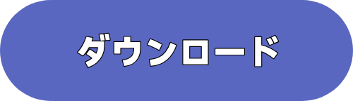

#️⃣ [English](README.md) | [中文](README_CN.md) | [Tiếng Việt](README_VI.md) | [日本語](README_JP.md)

<h1 align="center">
  
</h1>

# 🗺️ プロジェクト概要 (Project Overview)
OneUI-Lockscreen-Font-EXT は、OneUIのロック画面で使えるフォントを追加するプロジェクトです。
※OneUI 6以上が必要です。

    
    

### 🤔 仕組みは？ (How it works?)
ZIP内にあるAPKをインストールし、ロック画面エディタの「さらにフォントを表示（More Fonts）」オプションを開いてください。

### 😵 ステートメント (Statement)
 * iOSテーマに関連するものは**一切作成しません**。
 * 「OPPO Big Clock Sans」が収録されている理由は、iOS 26 [2025年9月15日] が「縦長時計スタイル」をリリースしたのが、Android (HyperOS) [2024年10月29日] よりも**後**だからです。そのため、私の中ではこれはAndroidスタイルとみなしています。
 * [関連情報](HeheJuice/Result.png)
 * 私はiOSのアンチではありませんし、iOSテーマ関連の制作を行わない理由は、Android独自のスタイルを保つためです。
 * これらを見て気分が悪くなった場合は、このサイトを離れることをお勧めします。
   
### ℹ️ 収録フォント ＆ クレジット (Available Fonts & Credits)
| フォント名 | クレジット |
|---|---|
| **OPPO Big Clock Sans** | OPPO |
| **HarmonyOS Sans Super Bold** | Huawei |
| **Bodoni Moda** | Owen Earl |
| **DM Serif Display** | Colophon Foundry |
| **Gravitas One** | Riccardo De Franceschi |
| **Creato Display Regular** | Anugrah Pasau |
| **Creato Display Bold** | Anugrah Pasau |
| **Badeen Display Regular** | Hani Alasadi |
| **Google Pixel Inflate** | Google |
| **Xiaomi Neu Rounded** | Xiaomi |
| **NothingOS NType** | Nothing |
| **NothingOS NDot** | Nothing |
| **CookieRun Bold** | Devsisters |
| **Moto Milky Stacked Regular** | Motorola |
| **Riviera Regular** | Johann Darcel |
| **Monoton** | Vernon Adams |
| **Mi Serif** | Xiaomi |
| **Chamberi Super Display Bold** | Iñigo Jerez & Francisco Torres |
| **GeistMono-Regular | Basement.studio, Andrés Briganti, Mateo Zaragoza |
| **Geist-Regular | Basement.studio, Andrés Briganti, Mateo Zaragoza |

### ❤️ 特別謝辞 (Special Thanks)
 * 素晴らしい成果物を提供してくださったすべてのフォントデザイナーの皆様に感謝いたします。
   
### ⚠️ 注意事項 (Notice)
 * このプロジェクトを動画や他のプラットフォームで共有する場合は、製作者やフォントデザイナーのクレジットを保証するため、GitHubのリンクを掲載していただけると幸いです（ありがとうございます）。
 * 本プロジェクトに関する最終的な解釈権はHeheJuiceに帰属します。
 * フォントの制作者は、自由にフォントの削除を要求する権利を有します。
 * フォントの削除を希望される場合は、以下よりご連絡ください（フォント制作者様向け）。
   * メール：HeheJuiceBomb@gmail.com ［フォント制作者様からのご連絡にのみ返信いたします。それ以外のファイル要求などの問い合わせは、この説明を最後まで読んでいないとみなし、**無視（スルー）**されます］
