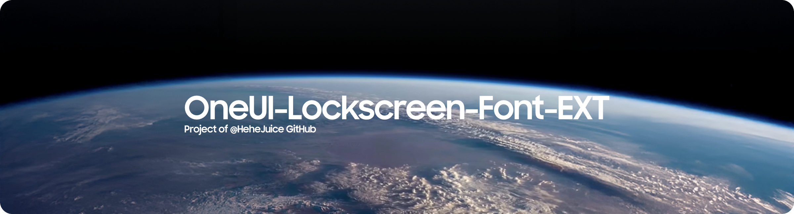

#️⃣ [English](README.md) | [中文](README_CN.md) | [Tiếng Việt](README_VI.md) | [日本語](README_JP.md)

<h1 align="center">
  
</h1>

# 🗺️ Tổng quan dự án
OneUI-Lockscreen-Font-EXT là một dự án giúp bạn thêm nhiều font chữ mới vào Màn hình khóa của OneUI.

**Yêu cầu:** Thiết bị chạy OneUI 6.0 trở lên.

### 🤔 Cách thức hoạt động?
Chỉ cần cài đặt file APK có trong file ZIP, sau đó mở phần chỉnh sửa Màn hình khóa của bạn lên và chọn mục "More Fonts" (Thêm phông chữ).

### 😵 Tuyên bố chính thức
> [!NOTE]
> * Mình sẽ **KHÔNG** làm bất cứ theme hay tính năng nào sao chép phong cách của iOS.
> * Lý do mình thêm font "OPPO Big Clock Sans" vào là vì iOS 26 (ra mắt 15/09/2025) có kiểu dáng "Đồng hồ dài" (Long Clock Style) ra mắt SAU Android (cụ thể là HyperOS, ra mắt 29/10/2024). Vì vậy, với mình thì đây vẫn được xem là phong cách đặc trưng của Android.
> * [Thông tin tham khảo thêm](ncatt/ResultVI.png)
> * Mình không hề ghét (anti) iOS. Mình không làm các nội dung liên quan đến theme iOS đơn giản vì muốn Android giữ được bản sắc và phong cách riêng của nó.
> * Nếu bạn cảm thấy không khỏe sau khi xem những nội dung này, chúng tôi khuyên bạn nên rời khỏi trang web này

### ℹ️ Danh sách font chữ hỗ trợ [Nguồn/Tác giả]

| Tên Font Chữ | Nguồn / Tác giả |
| :--- | :--- |
| **OPPO Big Clock Sans** | OPPO |
| **HarmonyOSSans Super Bold** | Huawei |
| **Bodoni Moda** | Owen Earl |
| **DM Serif Display** | Colophon Foundry |
| **Gravitas One** | Riccardo De Franceschi |
| **CreatoDisplayRegular** | Anugrah Pasau |
| **CreatoDisplayBold** | Anugrah Pasau |
| **BadeenDisplay-Regular** | Hani Alasadi |
| **Google Pixel Inflate** | Google |
| **XiaomiNeuRounded** | Xiaomi |
| **NothingOS NType** | Nothing |
| **NothingOS NDot** | Nothing |
| **CookieRunBold** | Devsisters |
| **MotoMilkyStackedRegular** | Motorola |
| **RivieraRegular** | Johann Darcel |
| **Monoton** | vernon adams |
| **MiSerifF** | Xiaomi |
| **ChamberiSuperDisplayBold** | Iñigo Jerez & Francisco Torres |
| **GeistMono-Regular** | Basement.studio, Andrés Briganti, Mateo Zaragoza |
| **Geist-Regular** | Basement.studio, Andrés Briganti, Mateo Zaragoza |
| **OPPO Big Clock Sans Short** | OPPO and Adjusted By HeheJuice |
| **OPPO Big Clock Sans Short No Colon** | OPPO and Adjusted By HeheJuice |
| **OPPO Big Clock Sans No Colon** | OPPO and Adjusted By HeheJuice |
| **HarmonyOS Sans Chinese Clock** | Huawei and Adjusted By HeheJuice |
| **NothingOS Thin No Colon** | Nothing and Adjusted By HeheJuice |

### ❤️ Lời cảm ơn đặc biệt 
- Xin gửi lời cảm ơn chân thành đến tất cả các nhà thiết kế vì những bộ font tuyệt vời này.

### ⚠️ Lưu ý quan trọng
> [!IMPORTANT]
> * Nếu bạn mang dự án này đi chia sẻ trong video hay trên các nền tảng khác, **RẤT MONG** bạn sẽ đính kèm link trang GitHub này để tôn trọng công sức của mình (người tạo ra dự án) cũng như các nhà thiết kế font chữ. Xin cảm ơn!
> * HeheJuice giữ quyền quyết định cuối cùng trong mọi trường hợp.
> * Các tác giả/nhà thiết kế font chữ có toàn quyền yêu cầu gỡ bỏ font của họ khỏi dự án bất cứ lúc nào.
> * Nếu bạn là tác giả font chữ và muốn gỡ bỏ sản phẩm của mình, vui lòng liên hệ với mình qua:
> *   - **Email:** HeheJuiceBomb@gmail.com 
   *(Lưu ý: Mình **chỉ phản hồi** email từ các tác giả font chữ. Các email khác với mục đích xin file chứng tỏ bạn chưa đọc kỹ trang này, và mình xin phép được **BỎ QUA**).*
> * Nhắn tin cho mình qua Telegram khi chưa được phép sẽ bị CẤM (BAN) khỏi Kênh Phát Hành (Release Channel).
